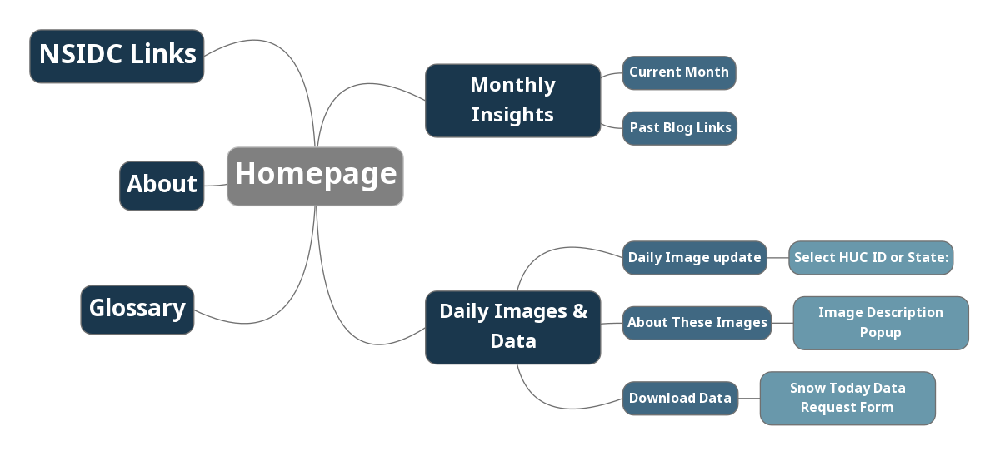
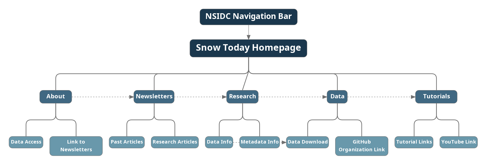

# Appendix B: Website Architecture {#appendixb}

```{r, auto_pdf = TRUE, echo=FALSE, message = FALSE, warning = FALSE, fig.cap="Current Snow Today Website Architecture"}



```

```{r, auto_pdf = TRUE, echo=FALSE, message = FALSE, warning = FALSE, fig.cap="Recommended Snow Today Website Architecture"}



```