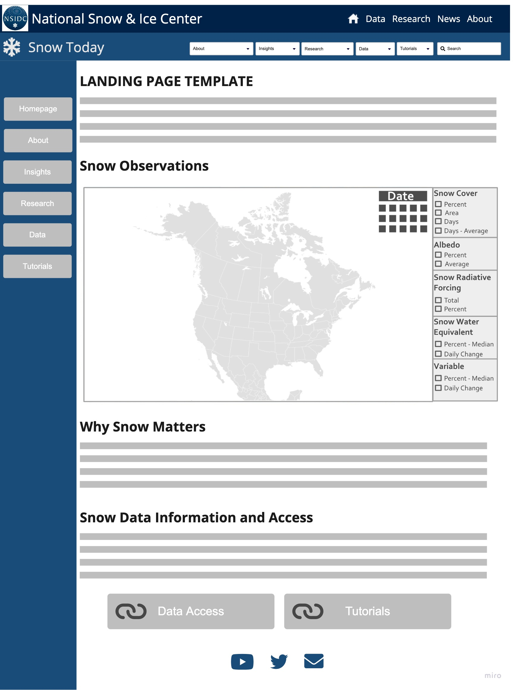
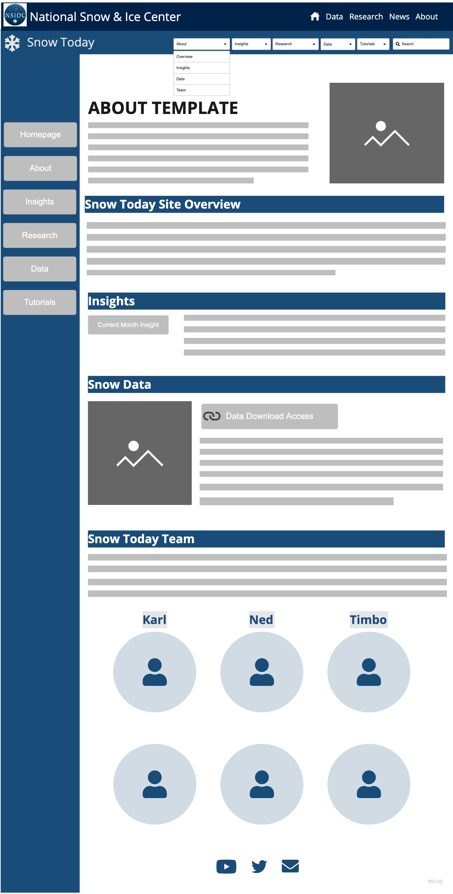
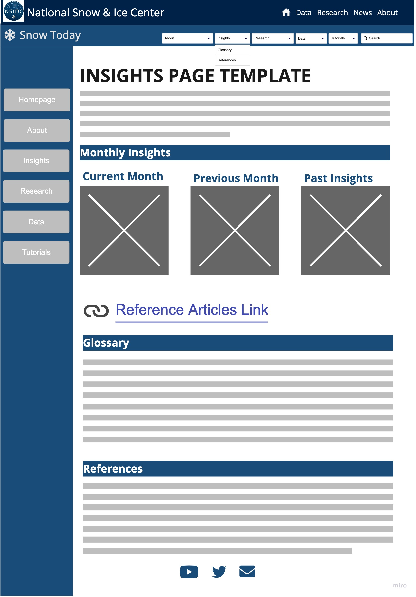
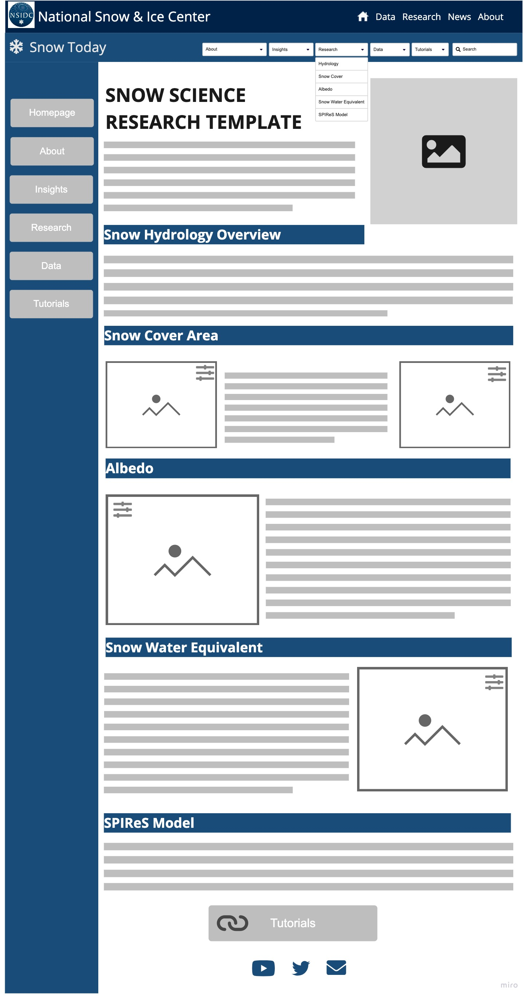

# Appendix C: Wireframe {#appendixc}

```{r, auto_pdf = TRUE, echo=FALSE, message = FALSE, warning = FALSE, fig.cap="WireFrame design for the recommeneded Snow Today website 'Landing' page update"}



```

```{r, auto_pdf = TRUE, echo=FALSE, message = FALSE, warning = FALSE, fig.cap="WireFrame design for the recommeneded Snow Today website 'About' page update"}



```

```{r, auto_pdf = TRUE, echo=FALSE, message = FALSE, warning = FALSE, fig.cap="WireFrame design for the recommeneded Snow Today website 'Insights' page update"}



```

```{r, auto_pdf = TRUE, echo=FALSE, message = FALSE, warning = FALSE, fig.cap="WireFrame design for the recommeneded Snow Today website 'Snow Science Research' page update"}



```

```{r, auto_pdf = TRUE, echo=FALSE, message = FALSE, warning = FALSE, fig.cap="WireFrame design for the recommeneded Snow Today website 'Data' page update"}


```

```{r, auto_pdf = TRUE, echo=FALSE, message = FALSE, warning = FALSE, fig.cap="WireFrame design for the recommeneded Snow Today website 'Tutorial' page update"}

knitr::include_graphics("images/ST06_Tutorial.jpg")

```


