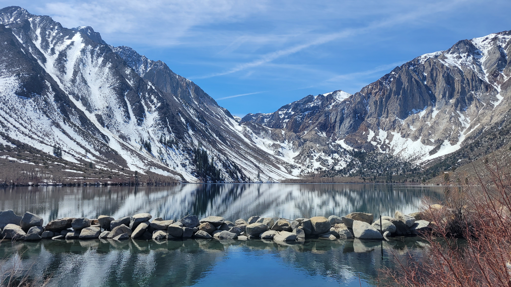

--- 
title: "Improving Usability of Snow Data through Web-based Visualizations and Tutorials"
subtitle: "An Open Source Workflow for Processing and Visualizing Snow Data"
author: 
  - Ryan Munnikhuis | Bren School of Environmental Science & Management | MEDS 2022
  - Julia Parish | Bren School of Environmental Science & Management | MEDS 2022
  - Marie Rivers | Bren School of Environmental Science & Management | MEDS 2022
date: '2022-06-03'
site: bookdown::bookdown_site
output: bookdown::gitbook
documentclass: book
bibliography: [bibiliography.bib, packages.bib]
biblio-style: apalike
link-citations: yes
github-repo: MEDSsnowtoday/Technical_Documentation
description: "MEDS Snow Today Capstone Project Technical Documentation"
---

# Technical Documentation {-}

```{r setup, echo=FALSE, message = FALSE, warning = FALSE}
knitr::opts_chunk$set(echo = F,
                      message = F,
                      warning = F)

knitr::opts_chunk$set(tidy.opts=list(width.cutoff=60),tidy=TRUE)

#update.packages(ask = FALSE, checkBuilt = TRUE)  # update R packages

#source directories
image.dir <- here::here("images")


library(tidyverse)
library(here)
library(kableExtra)
library(knitr)
library(shiny)


```


```{r convict, auto_pdf = TRUE, fig.height = 6}



```

Wit-sa-nap, or Convict Lake. Sierra Nevada mountains, Mono County, California. <br>
**Image Credit:** J. Parish


```{r, auto_pdf = TRUE, fig.align = 'center', fig.height = 4}

```
